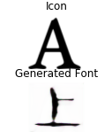

# logo2glyph

Code modified from Github project: pix2pix of [Keras_gan](https://github.com/eriklindernoren/Keras-GAN)

Network Architecture /

Generator Architecture /

Huawei Logo Training process:

Nike Logo Training process:

Adidas Logo Training process:

## Results

Zero-shot glyph generation test:

Rebuild (Can be used as a Invisible Watermark)

Style Addition

